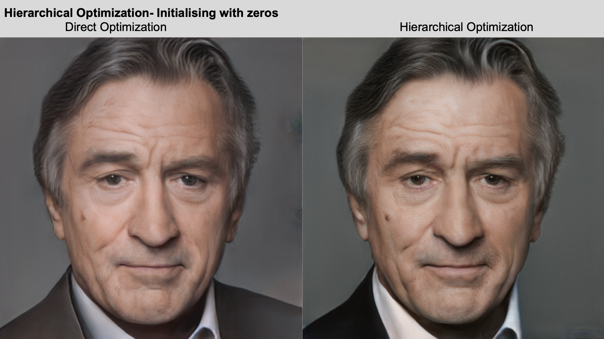
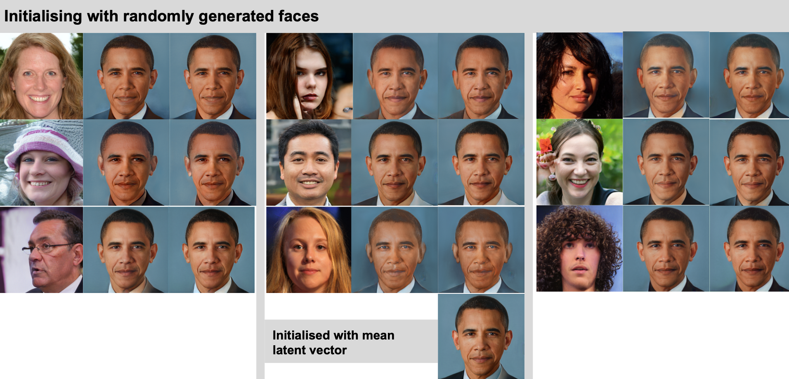
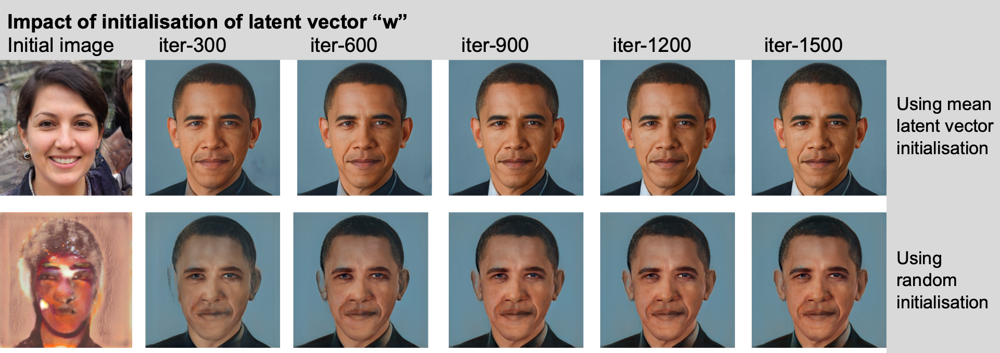
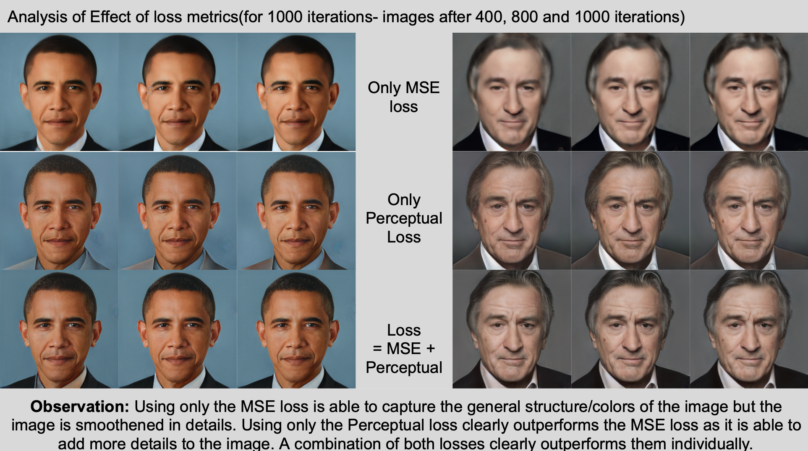
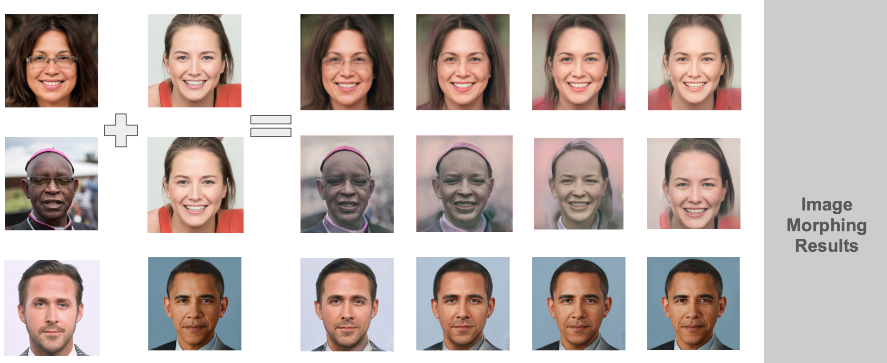

# Image2StyleGAN
This is an implementation of the paper Image2StyleGAN using StyleGAN-v1 as the backbone

## Acknowledgement
This project is a part of my internship at King Adbullah University of Science and Technology(KAUST) under the supervision of Professor Peter Wonka

## References
The code for the architecture was taken from https://github.com/pacifinapacific/StyleGAN_LatentEditor and the official TensorFlow weights were converted to Pytorch weights to be used in the project. This code uses the Official StyleGAN architecture from NVIDIA

## Pre-trained Model
If you need the pre-trained SG model used as a backbone in the experiments, please contact me.

## Experimental Results

Stay tuned for some more results on various experimental results.
